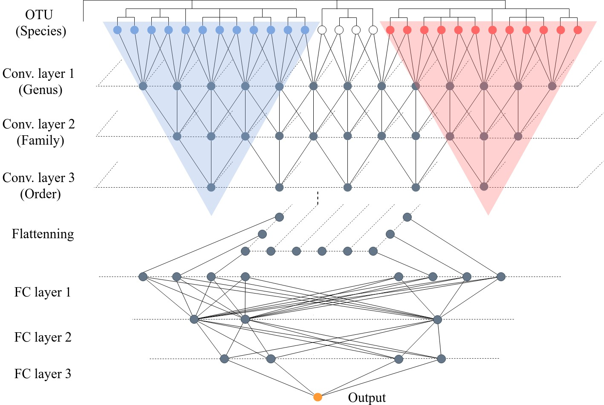

# MDeep-implementation
Implementation of MDeep and evaluation based on Bukavina et al. [1] to study the association between Urinal Microbiome and Bladder Cancer 

## Data Management

This repository contains the implementation code for MDeep [2]. The raw genomic sequencing data files (`.gz`, `.fq.gz`, `.fastq.gz`) are not included in this repository due to their large size and incompatibility.

### Datasets 
The data directory contains _merged_ genomic sequencing data from three countries: 3_countries, China_Hung, Croatia_Hung, where:
- `China` - Chinese cohort samples (62 cancer patients and 19 healthy controls) [3]
- `Croatia` - Croatian cohort samples (14 cancer patients and 11 healthy controls) [4]
- `Hungary` - Hungarian cohort samples (10 cancer patients) [5]

### Data Structure
The data is organized as follows:
- X_train and X_eval: Training and evaluation datasets containing OTU (Operational Taxonomic Unit) abundance profiles.
- Y_train and Y_eval: Corresponding labels for the training and evaluation datasets, indicating disease status (e.g., 1 for cancer vs. 0 for control).
- c.npy: Contains phylogeny-induced correlation structure C

### Data Processing
End-to-End Data Processing Workflow for MDeep
#### Phase 1: QIIME 2 - Processing Each Dataset Individually
- Step 0: Access Qiime 2 using either conda, preferably, or docker
- Step 1: Import the raw data into Qiime 2 .qza artifact format using `qiime tools import`
- Step 2: Join paired-end reads by merging forward and reverse reads using `qiime vsearch join-pairs`
- Step 3: Filer out low-quality reads using `qiime quality-filter q-score`
- Step 4: Dereplicate sequences using `qiime vsearch dereplicate-sequences`
- Step 5: Cluster sequences into OTUs using `qiime vsearch cluster-features-de-novo`
- Step 6: Identify chimeric sequences using `qiime vsearch uchime-denovo` and filter out chimeric sequences using `qiime feature-table filter-features`
- Step 7: Assign taxonomy to 97% OTUs comparing to silva 99% database using `qiime feature-classifier classify-sklearn`
- Step 8: Export the OTU table to a BIOM file using `qiime tools export`
#### Phase 2: Merging Datasets and Preprocessing in Python
- Step 9.1: Install requirements using pip, R, rpy2 and the R package `GUniFrac` using Conda 
- Step 9.2: Organize the OTU tables and representative sequences from different countries into corresponding directories
- Step 10: Merge representative sequences from different countries using `qiime feature-table merge-seqs`
- Step 11: Convert OTU tables from BIOM to pandas DataFrames and merge from different countries
- Step 12: MDeep filtering pipeline:
  1. Remove OTUs with less than 10 reads across all samples
    
  2. Remove OTUs with less than 5 reads in at least one sample
    
  3. Remove samples with less than 1000 reads
    
  4. Remove samples with more than 50% of OTUs having zero abundance
    
  5. Remove OTUs that are not present in at least 2 samples
- Step 13: Convert the filtered DataFrame to a NumPy array as the abundance matrix and corresponding feature index
#### Phase 3: Creating final model input files
- Step 14: Filter the merged representative sequences to keep only those that are present in the filtered abundance matrix using `qiime feature-table filter-seqs`
- Step 15: Align the filtered representative sequences to get rooted phylogenetic tree with FastTree using `qiime alignment mafft-fasttree`
- Step 16: Export the rooted tree to Newick format using `qiime tools export`
- Step 17: Calculate patristic distance matrix D from the rooted tree with skbio, transform it to the correlation matrix C and its index
- Step 18: Align the abundance matrix with c matrix and c index to create final X.npy and c.npy as well as Y.npy
- Step 19: Split the final X.npy and Y.npy into training and evaluation sets, saving them as X_train.npy, X_eval.npy, Y_train.npy, and Y_eval.npy

## MDeep Architecture

MDeep is a deep learning framework for microbiome-based binary classification. It leverages the hierarchical structure of microbial taxa by applying convolutional layers along the phylogenetic tree, followed by fully connected layers for prediction.

### Model Overview
- **Input:** OTU \(Operational Taxonomic Unit\) abundance profiles  
- **Hierarchical Convolutions:**  \(2 layers in this example\)
  - Conv. layer 1: Genus  
  - Conv. layer 2: Family  
  - Conv. layer 3: Order  
- **Flattening:** Output of the last convolutional layer is flattened  
- **Fully Connected Layers:** \(2 layers in this example\)  
- **Output:** Binary classification \(e.g., disease vs. control\)

</img>
**Figure. Schematic of the MDeep model architecture. Convolutional layers operate along the phylogenetic tree, followed by fully connected layers.**

## Results
Below are example ROC curves and AUC scores for different datasets:

  

Figure 1. All 3 countries &emsp;&emsp;Figure 2. China and Hungary

 </img>

Figure 3. Croatia and Hungary &emsp;&emsp;Figure 4. Original ML model performance 

Compared to the original ML model, MDeep achieves better performance on all datasets (0.76 to 0.577, 0.88 to 0.619, 1.0 to 0.757), demonstrating the effectiveness of deep learning in microbiome-based classification tasks and MDeep's superior ability to leverage hierarchical microbial structures to capture both local and global patterns in the data.

## References

[1] Bukavina, L., et al. "Global Meta-analysis of Urine Microbiome: Colonization of Polycyclic Aromatic Hydrocarbon–degrading Bacteria Among Bladder Cancer Patients"

[2] MDeep GitHub Repository: [https://github.com/lichen-lab/MDeep/tree/master]

MDeep Paper: Wang et al. "A novel deep learning method for predictive modeling of microbiome data"

[3] Zeng et al. "Alterations in Urobiome in Patients With Bladder Cancer and Implications for Clinical Outcome: A Single-Institution Study"

[4] Popović et al. "The urinary microbiome associated with bladder cancer"

[5] Mansour et al. "Bladder cancer-related microbiota: examining differences in urine and tissue samples"

