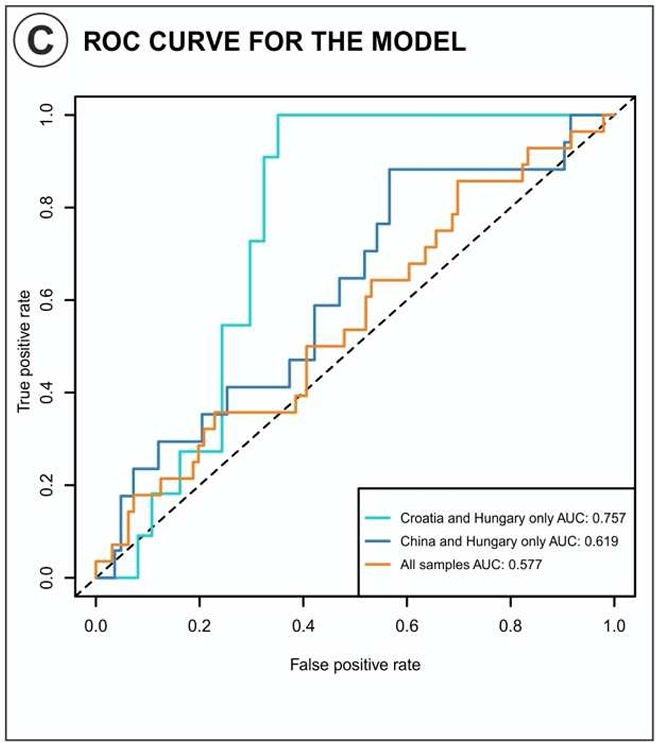

# MDeep-implementation
Implementation of MDeep and evaluation based on Bukavina et al. [1] to study the association between Urinal Microbiome and Bladder Cancer 

## Data Management

This repository contains the implementation code for MDeep [2]. The raw genomic sequencing data files (`.gz`, `.fq.gz`, `.fastq.gz`) are not included in this repository due to their large size and incompatibility.

### Datasets 
The data directory contains _merged_ genomic sequencing data from three countries: 3_countries, China_Hung, Croatia_Hung, where:
- `China` - Chinese cohort samples (62 cancer patients and 19 healthy controls) [3]
- `Croatia` - Croatian cohort samples (14 cancer patients and 11 healthy controls) [4]
- `Hungary` - Hungarian cohort samples (10 cancer patients) [5]

### Data Structure
The data is organized as follows:
- X_train and X_eval: Training and evaluation datasets containing OTU (Operational Taxonomic Unit) abundance profiles.
- Y_train and Y_eval: Corresponding labels for the training and evaluation datasets, indicating disease status (e.g., 1 for cancer vs. 0 for control).
- c.npy: Contains phylogeny-induced correlation structure C

## MDeep Architecture

MDeep is a deep learning framework for microbiome-based binary classification. It leverages the hierarchical structure of microbial taxa by applying convolutional layers along the phylogenetic tree, followed by fully connected layers for prediction.

### Model Overview
- **Input:** OTU \(Operational Taxonomic Unit\) abundance profiles  
- **Hierarchical Convolutions:**  \(2 layers in this example\)
  - Conv. layer 1: Genus  
  - Conv. layer 2: Family  
  - Conv. layer 3: Order  
- **Flattening:** Output of the last convolutional layer is flattened  
- **Fully Connected Layers:** \(2 layers in this example\)  
- **Output:** Binary classification \(e.g., disease vs. control\)

</img>
**Figure. Schematic of the MDeep model architecture. Convolutional layers operate along the phylogenetic tree, followed by fully connected layers.**

## Results
Below are example ROC curves and AUC scores for different datasets:

   </img>

Figure 1. All 3 countries &emsp;&emsp;Figure 2. China and Hungary &emsp;&emsp;Figure 3. Croatia and Hungary &emsp;&emsp;Figure 4. Original ML model performance

Compared to the original ML model, MDeep achieves better performance on all datasets (0.76 to 0.577, 0.88 to 0.619, 1.0 to 0.757), demonstrating the effectiveness of deep learning in microbiome-based classification tasks and MDeep's superior ability to leverage hierarchical microbial structures to capture both local and global patterns in the data.

## References

[1] Bukavina, L., et al. "Global Meta-analysis of Urine Microbiome: Colonization of Polycyclic Aromatic Hydrocarbon–degrading Bacteria Among Bladder Cancer Patients"

[2] MDeep GitHub Repository: [https://github.com/lichen-lab/MDeep/tree/master]

MDeep Paper: Wang et al. "A novel deep learning method for predictive modeling of microbiome data"

[3] Zeng et al. "Alterations in Urobiome in Patients With Bladder Cancer and Implications for Clinical Outcome: A Single-Institution Study"

[4] Popović et al. "The urinary microbiome associated with bladder cancer"

[5] Mansour et al. "Bladder cancer-related microbiota: examining differences in urine and tissue samples"

